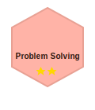
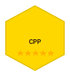
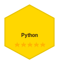
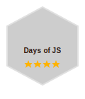
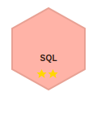
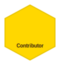

# Hey! 👋 I'm Baga6312

## About Me
* 💻 **Software Developer**
* 🐧 **Linux Enthusiast**
* 🔐 **Cyber Security** enthusiast
* 🚀 Currently learning **Go** for DevOps
* 🏁 **CTF Player**
* ♟️ **Chess Lover**

## 🏆 Platform Status

### HackTheBox

  

### TryHackMe

  

### HackerRank

  
   
  

**🏆 My Badges**

  
  
  
  
  
  

🔗 **Profile**: [HackerRank/Baga6312](https://www.hackerrank.com/Baga6312)

## 🛠️ Current Focus
* 🔥 Learning **Go** for DevOps workflows
* 🎯 Solving HTB machines
* 🧩 Participating in CTFs
* ♟️ Playing chess when not coding

## 📊 GitHub Stats

## 📫 Connect

*"Code, Hack, Learn, Repeat"* 🔄
