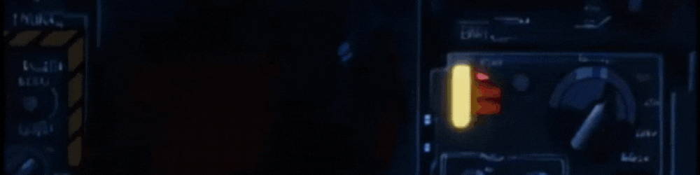
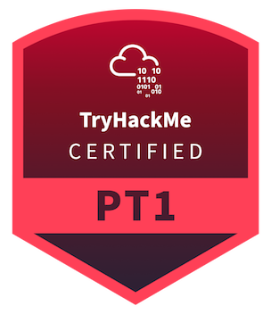

  

<h3> <strong>Hey!</strong></h3>
 
 
<ul style="list-style-type=none;">
    <li>I'm <strong>Baga6312</strong> (also known as <strong>R1BIT99</strong>), a Software developer with a strong passion for all open source things.</li>
    <li>Linux and Hacker .</li>
    <li>I love pixelart too and web dev , i do Game dev from time to time.</li>
</ul>

 

<ul>
<li>
I'm always open to new ideas and opportunities. You can learn more about me or connect with me on LinkedIn 👥. Feel free to reach out to me directly at oussema.benayech@gmail.com . Let's connect and explore exciting possibilities together! 🚀
</li>
</ul>
 

### 🏆 Platform Status

<table style="border-collapse: collapse;">
  <tr>
    <td style="vertical-align: middle; padding: 0; border: none;">
      
    </td>
    <td style="vertical-align: middle; padding: 0; border: none;">
        
    </td>
  </tr>
</table>

### Badges

  
  
 ⠀

  
  
 ⠀

  
  
 ⠀

  
  
 ⠀

  

🔗 **Profile**: [HackerRank/Baga6312](https://www.hackerrank.com/Baga6312)
   
  
  
  

### Tech that i use

    
    
    
    
    
    
    
    
    
    
    
    
    
    
    
    
    
    
    
    
    
    
    

 

  &nbsp;&nbsp;&nbsp;&nbsp;&nbsp;&nbsp;&nbsp;&nbsp;&nbsp;&nbsp;
  

    <!--- -->
    
 
  
 
  

  

    
📣 need a contact ? :

  

  

    
    

